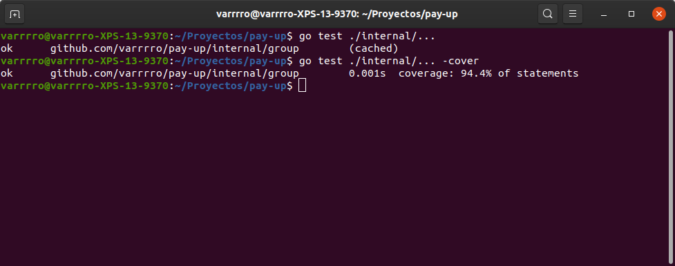

# Desarrollo basado en pruebas

## Ejercicio 1: Instalar alguno de los entornos virtuales de node.js (o de cualquier otro lenguaje con el que se esté familiarizado) y, con ellos, instalar la última versión existente, la versión *minor* más actual de la 4.x y lo mismo para la 0.11 o alguna impar (de desarrollo)

Usaremos nvm para el uso de distintas versiones de node. Usando el siguiente comando, descargamos y ejecutamos el *script* de instalación, tal y coomo se indica en su guía [repo](https://github.com/nvm-sh/nvm).

```bash
curl -o- https://raw.githubusercontent.com/nvm-sh/nvm/v0.35.0/install.sh | bash
```

Una vez hecho esto, ya podemos usar la herramienta de nvm para gestionar las instalaciones de node. Por defecto, usa la versión que está instalada en el sistema. La última versión de node cuando se está escribiendo esto es la 13.0.1, que podemos instalar con el comando:

```bash
nvm install 13.0.1
```

De igual manera, podemos instalar la última versión minor de 4.x o la 0.11 especificando en el comando anterior la versión deseada.

```bash
nvm install 4.9.1
nvm install 0.11.0
```


Una vez tenemos instaladas varias versiones, podemos elegir la versión a utilizar usando:

```bash
nvm use x.x.x
```

También podemos ejecutar un programa usando una versión concreta con:

```bash
nvm run x.x.x app.js
```

## Ejercicio 2: Crear una descripcion del módulo usando `package.json`. En caso de que se trate de otro lenguaje, usar el método correspondiente

En mi proyecto uso el lenguaje Go, el cual también permite la creación de módulos desde su versión 1.11. En este caso, se usa un archivo `go.mod` para especificar el nombre del módulo (su ruta, como es habitual en Go) y las dependencias explícitas del mismo.

El archivo `go.mod` que he creado para mi proyecto se puede ver [aquí](https://github.com/Varrrro/pay-up/blob/master/go.mod). **NOTA:** Es posible que en el momento que esté observando este archivo, solo contenga el nombre del módulo y la versión de Go utilizada. La herramienta de módulos de Go añade automáticamente a este fichero las dependencias que necesita el proyecto, por lo que no aparecerán hasta que se importen desde los ficheros internos.

## Ejercicio 3: Descargar el repositorio de ejemplo anterior, instalar las herramientas necesarias (principalmente Scala y sbt) y ejecutar el ejemplo desde `sbt`. Alternativamente, buscar otros marcos para REST en Scala tales como Finatra o Scalatra y probar los ejemplos que se incluyan en el repositorio

Para poder instalar y usar Scala y `sbt`, necesitamos la versión 8 de Java. En mi máquina tengo instalada la versión 11, por lo que hacemos:

```bash
sudo apt update
sudo apt install openjdk-8-jdk
sudo update-java-alternatives --set /usr/lib/jvm/java-1.8.0-openjdk-amd64
```

La ruta a la instalación de java podemos obtenerla usando `update-java-alternatives --list`. Ahora, si ejecutamos `java -version` nos debe indicar la versión 1.8 del JDK.

Una vez hecho esto, instalamos la versión 2.11 de Scala, ya que es la que usa el proyecto con el que vamos a trabajar.

```bash
wget www.scala-lang.org/files/archive/scala-2.11.0.deb
sudo dpkg -i scala*.deb
```

Ahora que tenemos instalado Scala, instalamos `sbt`.

```bash
echo "deb https://dl.bintray.com/sbt/debian /" | sudo tee -a /etc/apt/sources.list.d/sbt.list
sudo apt-key adv --keyserver hkp://keyserver.ubuntu.com:80 --recv 2EE0EA64E40A89B84B2DF73499E82A75642AC823
sudo apt update
sudo apt install sbt
```

Una vez hecho esto, podemos ejecutar `sbt test` para comprobar que la instalación es correcta.

Siguiendo los pasos indicados en el [repo del proyecto](https://github.com/JJ/spray-test), clonamos, compilamos y ejecutamos el código de la aplicación, accediendo a `http://localhost:8080` para verla funcionando. En las siguientes imágenes podemos ver las pruebas realizadas sobre la página.


## Ejercicio 4: Para la aplicación que se está haciendo, escribir una serie de aserciones y probar que efectivamente no fallan. Añadir tests para una nueva funcionalidad, probar que falla y escribir el código para que no lo haga. A continuación, ejecutarlos desde `mocha` (u otro módulo de test de alto nivel) usando descripciones del test y del grupo de test de forma correcta. Si hasta ahora no has subido el código que has venido realizando a GitHub, es el momento de hacerlo, porque lo vamos a necesitar un poco más adelante

Las aserciones para mi proyecto se escribirán una vez realizado el seminario sobre desarrollo dirigido por pruebas.

Nos vamos a basar en las pruebas escritas para el tipo `Grupo` de mi proyecto, cuya definición se presenta a continuación.

```go
// Group of people, each of which have a balance in the group.
type Group struct {
    ID      int
    Name    string
    Members map[string]float32
}

// AddMember to the given group.
func (g *Group) AddMember(member string) error {
    if g.Members == nil {
        g.Members = make(map[string]float32)
    }

    if _, prs := g.Members[member]; prs {
        return &ExistingMembersError{g.ID, []string{member}}
    }

    g.Members[member] = 0.0

    return nil
}

// AddMembers to the given group.
func (g *Group) AddMembers(members []string) error {
    if g.Members == nil {
        g.Members = make(map[string]float32)
    }

    var exs []string

    for _, m := range members {
        if _, prs := g.Members[m]; prs {
            exs = append(exs, m)
            continue
        }

        g.Members[m] = 0.0
    }

    if len(exs) != 0 {
        return &ExistingMembersError{g.ID, exs}
    }

    return nil
}
```

Para probar que esta funcionalidad es correcta, escribimos las siguientes pruebas:

```go
func TestAddMember(t *testing.T) {
    g := Group{ID: 123, Name: "Test Group"}
    m := "Test Member"

    err := g.AddMember(m)

    if err != nil {
        t.Errorf("Couldn't add new member. Error: " + err.Error())
    }

    if b := g.Members[m]; b != 0 {
        t.Errorf("Balance of new member (%s) is not zero (%f).", m, b)
    }
}

func TestAddExistingMember(t *testing.T) {
    g := Group{ID: 123, Name: "Test Group"}
    m := "Test Member"

    g.AddMember(m)
    err := g.AddMember(m)

    if err == nil {
        t.Errorf("Adding duplicate member didn't return an error.")
    }

    if len(g.Members) > 1 {
        t.Errorf("Existing member was added to the group.")
    }
}

func TestAddMembers(t *testing.T) {
    g := Group{ID: 123, Name: "Test Group"}

    err := g.AddMembers([]string{"Test1", "Test2"})

    if err != nil {
        t.Errorf("Couldn't add new members. Error: " + err.Error())
    }

    for k, v := range g.Members {
        if v != 0.0 {
            t.Errorf("Balance of new member (%s) is not zero (%f).", k, v)
        }
    }
}

func TestAddExistingMembers(t *testing.T) {
    g := Group{ID: 123, Name: "Test Group"}

    err := g.AddMembers([]string{"Test1", "Test2", "Test2"})

    if err == nil {
        t.Errorf("Adding duplicate member didn't return an error")
    }

    if len(g.Members) != 2 {
        t.Errorf("Existing member was added to the group.")
    }
}
```

A diferencia de otros lenguajes, `Go` no dispone de marcos de prueba de alto nivel, sino que integra en su propio *toolchain* las herramientas necesarias para ejecutar estas pruebas. Así, usamos `go test` para lanzar las pruebas y obtener los siguientes resultados.



Como se puede apreciar, si añadimos el flag `-cover` se realiza también un análisis de la cobertura del código.
